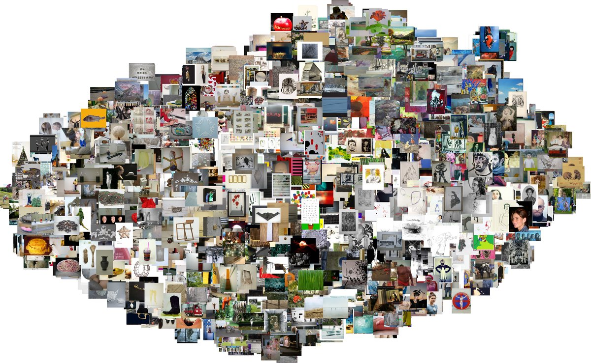

# flachware

A noisy image dataset of contemporary art from [flachware.de](https://www.flachware.de) for computational art analysis.



This dataset contains ~12,000 images uploaded by 670+ students and alumni of the Academy of Fine Arts Munich between 2006 and 2026, along with structured metadata (academy class, enrollment year, medium, dimensions). Since artists upload everything to their profiles, not just finished artworks, the raw dataset includes a significant amount of non-art content: gallery documentation, event photos, flyers, and portraits. A CLIP-based art score is provided for each image so users can filter to their desired quality level. At the default threshold (art_score > 0.5), roughly 64% of images are classified as art. A stricter cut at 0.7 yields a cleaner but smaller subset.

## About flachware.de

Flachware is a nonprofit online platform founded in 2006 by students of the Academy of Fine Arts Munich (Akademie der Bildenden Kuenste Muenchen), one of Germany's oldest and most respected art academies. The platform gives current students and alumni a place to present their work publicly. Each artist gets a profile page where they upload images of their paintings, sculptures, installations, photography, video stills, and other work, along with free-form biographical and exhibition information.

The name "Flachware" is German art slang for flat goods, meaning paintings and prints (as opposed to three-dimensional work). The site has grown organically over nearly 20 years and now contains profiles of 670+ artists spanning enrollment years from the late 1990s to today.

What makes this dataset interesting for research: every artist is associated with a "Klasse" (class), the studio group of a specific professor. This mentorship structure is central to how German art academies work. The dataset captures which professor each artist studied under, when they enrolled, and what kind of work they produced, enabling studies on artistic influence, stylistic clustering by class, medium trends over time, and more.

## What's in the dataset

Two CSV tables plus artwork images:

`artists.csv` (one row per artist):

| Column | Description |
|--------|-------------|
| slug | URL identifier (e.g. `abir-kobeissi`) |
| name | Full name |
| academy_class | Professor/class (e.g. `Voigt`, `Oehlen`, `Doberauer`) |
| year_start | Year of enrollment at the academy |
| last_updated | Date the artist last updated their profile |
| website | Personal website, where available |
| birth_info | Birth year and place, where available |

`artworks.csv` (one row per artwork image):

| Column | Description |
|--------|-------------|
| artist_slug | Foreign key to `artists.csv` |
| image_id | Unique filename (e.g. `abir-kobeissi_001.jpg`) |
| image_url | Original URL on flachware.de |
| title | Artwork title (extracted from caption) |
| year | Year of creation |
| medium | Materials and technique (e.g. `oil on canvas`) |
| dimensions | Size in cm (e.g. `240 x 210 cm`) |
| caption_raw | Unprocessed caption text |
| sha256 | Checksum of the downloaded image file |
| art_score | CLIP art confidence, 0.0 (noise) to 1.0 (art) |
| is_art | Boolean convenience column (art_score > 0.5) |

Images are organized in `data/images/{artist-slug}/` and available as a download from [Zenodo](https://doi.org/10.5281/zenodo.19366178).

## Art vs noise classification

An important caveat for anyone using this dataset: not all images on flachware.de are actual artworks. Artists upload everything to their profile pages, including gallery documentation, event photos, exhibition flyers, artist portraits, and screenshots. In the raw dataset, roughly 36% of images fall into this "noise" category. Using them unfiltered for art analysis (e.g. style classification, visual similarity, generative modeling) will produce misleading results.

The `is_art` column in `artworks.csv` flags each image as art (`true`) or noise (`false`) using zero-shot classification with OpenAI's CLIP model (ViT-B/32). Each image is scored against two sets of text prompts:

Art prompts: "a painting", "a sculpture", "a drawing", "an artwork", "a print", "an art installation", "a photograph of art", "abstract art", "a sketch", "a ceramic artwork"

Noise prompts: "a photo of people at an event", "a group photo", "a gallery room", "an empty room", "a document", "text on a page", "a screenshot", "a flyer", "a poster with text", "a selfie"

An image is classified as art if the sum of its cosine similarities to the art prompts exceeds the sum for the noise prompts (after softmax normalization). In the March 2026 crawl, this classified ~64% of images as art and ~36% as noise.

To reproduce or update the classification:

```bash
uv sync --group analysis   # installs torch, transformers, etc.
uv run flachware classify
```

The prompts and logic are in `src/flachware/classify.py` and can be adjusted.

## Data coverage

Based on the March 2026 crawl (671 artists, 12,268 artworks, 12,648 images including recovered 2021 originals):

| Field | Coverage |
|-------|----------|
| Artist name, slug | 100% |
| Academy class | 100% |
| Year of enrollment | 99% |
| Artwork title | 54% |
| Year of creation | 42% |
| Medium/technique | 30% |
| Dimensions | 18% |
| is_art (CLIP) | 100% |

Coverage for artwork-level fields varies because artists format their pages freely. There is no enforced schema on flachware.de. The parser extracts what is machine-readable from unstructured captions and leaves NULLs where it cannot.

## Quick start

```bash
git clone https://github.com/georgeblck/flachware.git
cd flachware
uv sync

# Download the pre-built image archive from the release
# (extract into the repo root so images land in data/images/)
tar xzf flachware-images-2026-03.tar.gz -C data/

# Or crawl everything fresh from flachware.de
uv run flachware run
```

The crawler is resumable and uses async concurrent downloads (5 connections by default). Re-running skips pages and images already on disk. Individual steps can be run separately:

```bash
uv run flachware crawl       # fetch HTML pages
uv run flachware parse        # extract metadata to CSV
uv run flachware download     # download images
uv run flachware validate     # check image integrity
uv run flachware classify     # CLIP art vs noise labels (needs --group analysis)
```

## License

The code in this repository is released under the MIT License.

The artwork images are the intellectual property of their respective artists. They are provided for non-commercial scientific research and education, in accordance with German copyright law (Section 60d UrhG, Section 44b UrhG). See the [LICENSE](LICENSE) file for full terms.

If you use this dataset in academic work, please cite:

```
Huckle, N. (2026). flachware: A dataset of contemporary art from the
Academy of Fine Arts Munich. https://github.com/georgeblck/flachware
```

## Related work

[contempArt](https://github.com/georgeblck/contempArt) is a broader dataset for computational art analysis covering multiple sources. flachware focuses on a single institution and provides a deeper longitudinal view of one art school's output from 2006 to the present.
